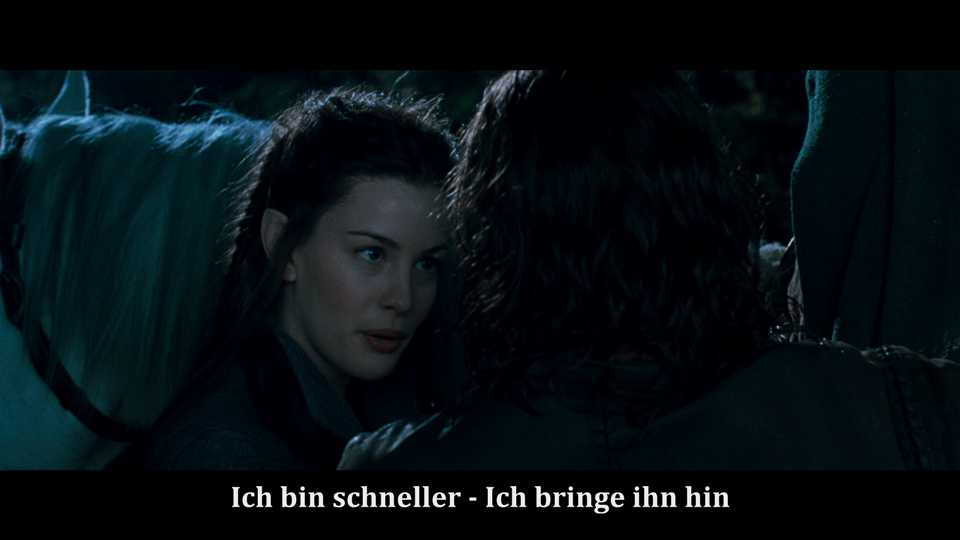
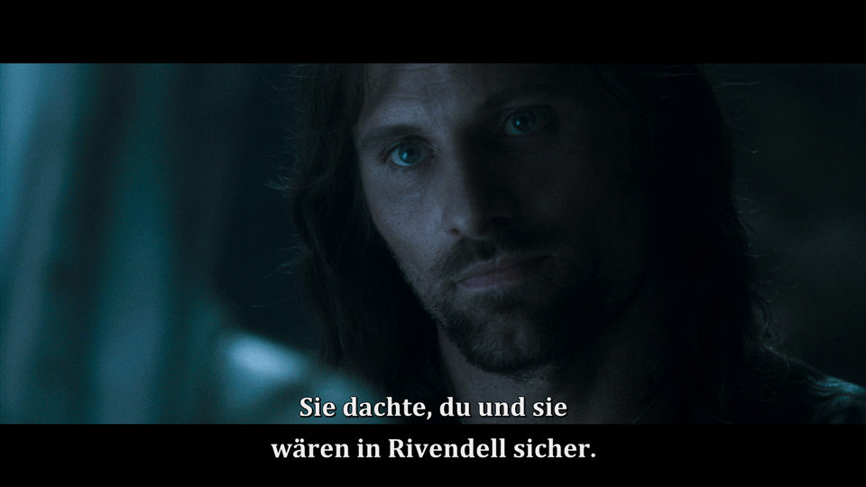

# The Lord of the Rings: Extended Edition [German Subtitle Fix]

Corrected **Elvish subtitle tracks** for the **2011 German Extended Edition Blu-ray** of **The Lord of the Rings: The Fellowship of the Ring** (***Der Herr der Ringe: Die Gefährten***). This fix addresses three well-known issues:

- *Disc 1*: **"I bin Arwen"** was mistakenly used instead of **"Ich bin Arwen"**, disrupting the scene's serious tone.
- *Disc 1*: A **missing period** at the end of a sentence.
- *Disc 2*: **"Rivendell"** was incorrectly used in place of the correct German term **"Bruchtal"**.

  
  

## **How to Use the Updated Subtitles**

> **Note**: Permitted for personal, non-commercial use only.

### **Step 1: Create MKV Files from Your Original Blu-ray Discs**

1. Insert the **Fellowship of the Ring Extended Edition: Disc 1** into your Blu-ray drive.
2. Install **[MakeMKV](https://www.makemkv.com/download/)**, then open it and select the Blu-ray disc.
3. Create the MKV file using default settings.
4. Repeat for **Fellowship of the Ring Extended Edition: Disc 2**.

### **Step 2: Replace the Subtitle Track with the Fixed Version**

1. Download the updated subtitle file for [Disc 1](https://github.com/jcoester/LOTR-EE-German-Subtitle-Fix/raw/main/lotr-ee-fotr1-german-subtitle-fix.sup) and [Disc 2](https://github.com/jcoester/LOTR-EE-German-Subtitle-Fix/raw/main/lotr-ee-fotr2-german-subtitle-fix.sup) from this repo.
2. Install **[MKVToolNix](https://mkvtoolnix.download/downloads.html)**, then open it and load:
   - a) the **MKV movie file**
   - b) the **updated subtitle file**.
3. **Deactivate** the Original Elvish Subtitle Track.
4. **Start Multiplexing** to create the new MKV file.

## **Technical Details**

The Elvish subtitles come in **Blu-ray PGS (Presentation Graphic Stream) subtitle file (.sup)** format, which is **image-based** rather than text-based. Using **[Subtitle Edit](https://www.nikse.dk/subtitleedit)**, the specific subtitle images were isolated and then edited in **[Photoshop](https://www.adobe.com/products/photoshop.html)**. **"Ich bin"** was reused from the latter part of the sentence, and the proper German term **"Bruchtal"** was carefully assembled by cutting and reusing letters from other parts of the subtitles to preserve the original font, rendering style, and spacing.