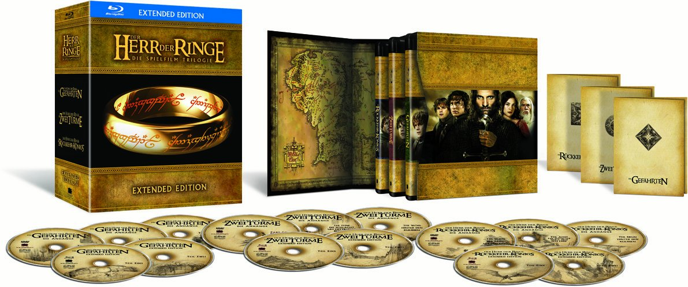

# The Lord of the Rings: Extended Edition [German Subtitle Fix]

Corrected **Elvish subtitle tracks** for the **2011 German Extended Edition Blu-rays** of **The Lord of the Rings: Trilogy** (***Der Herr der Ringe: Trilogie***). This fix addresses both **well-known** and lesser-known issues:

- *The Fellowship of the Ring (Die Gefährten)*:
   - *1:19:13 Disc 1* → **"I bin Arwen"** was mistakenly used instead of **"Ich bin Arwen"**, disrupting the scene's serious tone. 
   - *1:19:57 Disc 1* → **Missing period** at the end of a sentence.
   - *0:00:36 Disc 2* → **Comma sign** was used instead of a **period** at the end of a sentence.
   - *0:00:41 Disc 2* → **"Rivendell"** was incorrectly used instead of the German term **"Bruchtal"**.
     
- *The Two Towers (Die Zwei Türme)*:
   - *0:36:14 Disc 1* → **Jumping subtitle** due to formatting issue.
     
- *The Return of the King (Die Rückkehr des Königs)*:
   - *1:42:33 Disc 1* → **Inconsistent annotation** for Elvish text.
   - *1:46:43 Disc 2* → **Inconsistent annotation** for Elvish text.

## **Comparison: Before and After**

  
  

## **How to Use the Updated Subtitles**

### **Step 1: Create MKV Files from Your Original Blu-ray Discs**

> **Note**: Permitted for personal, non-commercial use only.

1. Insert the respective **Lord of the Rings Extended Edition Disc** into your Blu-ray drive.
2. Install **[MakeMKV](https://www.makemkv.com/download/)**, then open it and select the Blu-ray disc.
3. Create the **MKV file** using default settings.
4. Repeat for all **applicable discs**.

### **Step 2: Replace the Subtitle Track with the Fixed Version**

1. Download the **updated subtitles** for [FOTR Disc 1](https://github.com/jcoester/LOTR-EE-German-Subtitle-Fix/raw/main/lotr-ee-1-fotr-disc1-german-subtitle-fix.sup), [FOTR Disc 2](https://github.com/jcoester/LOTR-EE-German-Subtitle-Fix/raw/main/lotr-ee-1-fotr-disc2-german-subtitle-fix.sup), [TTT Disc 1](https://github.com/jcoester/LOTR-EE-German-Subtitle-Fix/raw/main/lotr-ee-2-ttt-disc1-german-subtitle-fix.sup), [ROTK Disc 1](https://github.com/jcoester/LOTR-EE-German-Subtitle-Fix/raw/main/lotr-ee-3-rotk-disc1-german-subtitle-fix.sup) & [ROTK Disc 2](https://github.com/jcoester/LOTR-EE-German-Subtitle-Fix/raw/main/lotr-ee-3-rotk-disc2-german-subtitle-fix.sup) from this repo.
2. Install **[MKVToolNix](https://mkvtoolnix.download/downloads.html)**, then open it and load:
   - a) the Disc 1 **MKV movie file**
   - b) the Disc 1 **updated subtitle file**.
3. **Deactivate** the original Elvish subtitle track.
4. **Start Multiplexing** to create the new MKV file.
5. Repeat for all **applicable discs**.

## **Technical Details**

The Elvish subtitles come in **Blu-ray PGS (Presentation Graphic Stream) subtitle file (.sup)** format, which is **image-based** rather than text-based. The ".sup" files were extracted from the MKVs using **[gMKVExtractGUI](https://mkvtoolnix.download/links.html)**. The specific subtitle images were isolated using **[Subtitle Edit](https://www.nikse.dk/subtitleedit)** and then edited in **[Photoshop](https://www.adobe.com/products/photoshop.html)**. **"Ich bin"** was reused from the latter part of the sentence, and the proper German term **"Bruchtal"** was carefully assembled by reusing letters from other parts of the subtitles to preserve the original font, rendering style, and spacing. **X offsets** were adjusted to ensure the **updated subtitles are perfectly centered**.

## **Why This Fix Matters**

The **Elvish subtitles** are crucial to the story, conveying important dialogue during key moments. A small error, such as **"I bin Arwen"**, can undermine the serious tone of the scene. Despite the release of the **2020 4K Remastered Extended Edition**, the **2011 Blu-ray Extended Edition** remains a fan favorite and is still regarded by some as the gold standard. This is because, among other issues, the 4K Remaster prominently introduced excessive **DNR (Digital Noise Reduction)**, which reduces fine detail, especially in wide shots. Restoring the subtitles using the provided fix helps preserve the **original spirit and quality** of the trilogy for German audiences.

## **Outlook**

I'm working on translating more of the Middle-earth language lines (e.g., Sindarin, Quenya, Khuzdûl, Black Speech, and Rohirric). The goal isn't to flood the films with new subtitles, but to focus on key moments where additional subtitles can enhance the viewing experience without overwhelming the viewer. An example of an added line missing in the official Blu-ray:

 
