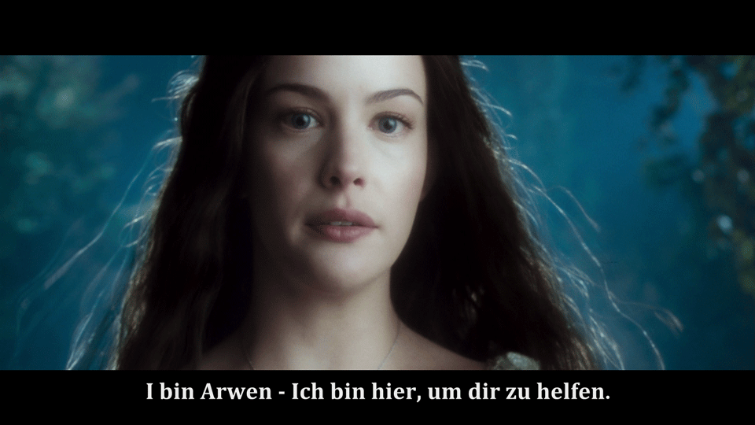

# LOTR-EE-German-Subtitle-Fix

A corrected **Elvish subtitle track** for the **2011 German Extended Edition Blu-ray** of **The Lord of the Rings: The Fellowship of the Ring** (**Der Herr der Ringe: Die Gefährten**). The fix addresses a typographical error where **“I bin Arwen”** was shown instead of the correct **“Ich bin Arwen”**. This error unintentionally evokes a humorous association with the German youth slang "[I bims](https://www.dw.com/en/i-bims-german-youth-word-of-the-year-2017/a-41422471)" which contradicts the serious tone of the scene.

## **How to Use the Updated Subtitles**

> **Note**: Permitted for personal, non-commercial use only.

### **Step 1: Create an MKV File from Your Original Blu-ray Disc**

1. Insert the **Fellowship of the Ring: Part 1 Extended Edition** into your Blu-ray drive.
2. Install **[MakeMKV](https://www.makemkv.com/download/)**, then open it and select the Blu-ray disc.
3. Create the MKV file. Default settings work well for this.

### **Step 2: Replace the Subtitle Track with the Fixed Version**

1. Download the [updated subtitle file](https://github.com/jcoester/LOTR-EE-German-Subtitle-Fix/raw/main/lotr-ee-fotr-german-subtitle-fix.sup) from this repo.
2. Install **[MKVToolNix](https://mkvtoolnix.download/downloads.html)**, then open it and load a) the **MKV movie file** and b) the **updated subtitle file**.
3. **Deactivate** the Original Elvish Subtitle Track.
4. **Start Multiplexing** to create the new MKV file.

## **Technical Details**

The Elvish subtitles are in the **Blu-ray PGS (Presentation Graphic Stream) subtitle file (.sup)** format, which is **image-based**, not text-based. To extract the .sup file from the MKV, **[gMKVExtractGUI](https://mkvtoolnix.download/links.html)** was used. After extracting the .sup file, the specific subtitle line was isolated as a PNG image using **[Subtitle Edit](https://www.nikse.dk/subtitleedit)**, and then edited in **[Adobe Photoshop](https://www.adobe.com/products/photoshop.html)**. The incorrect **“I bin”** was replaced with the correct **“Ich bin”** from the later part of the sentence. Upon replacing the previous incorrect subtitle image with the new correct one, the **X offset value** was adjusted to ensure that **the corrected line is perfectly centered** within the frame.
